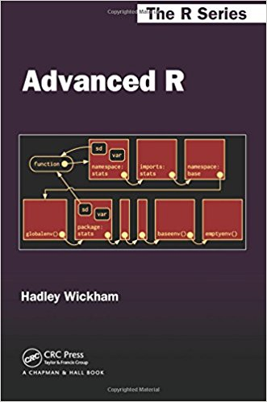
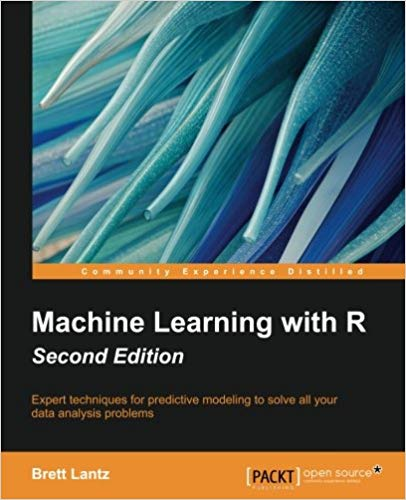

--------------   --------------------------------------
 **Schedule**    TBD
    **Staff**    Prof. Jan Vitek
  **Contact**    [Piazza](https://piazza.com/class/jnm6laxpxlq3yq) for all communication. Registration is open. 
------------   --------------------------------------

_Do you want to_

   * _create an impressive machine learning portfolio?_
   * _solve real data science problems?_
   * _improve your programming skills?_

#### Syllabus

This course encourages student to solve real-world data science problems by applying the skills they obtained in previous classes of the CCIS Data Science program.  Students will gain practical experience with the key steps of any data science project, namely, data import, data tyding and transformation, statistical modelling, and communication.  The course combines a programming component (in either R or Python) with a machine learning  and statistical modelling component. Repeatability and reproducibility of results will be emphasized.

#### Overview

Data Science is a discipline that combines computing with statistics. A data analysis problem is solved in a series of data-centric steps: data acquisition and representation (Import), data cleaning (Tidy), and an iterative sequence of data transformation (Transform), data modelling (Model) and data visualization (Visualize).  The end result of the process is to communicate insights obtained from the data (Communicate). This class will take you through all the steps in the process and will teach you how to approach such problems in a systematic manner. You will learn how to _design data analysis pipelines_ as well as how to _implement data analysis pipelines_. The class will also emphasize how elegant code leads to reproducible science.

The class will feature a couple small starter projects and one class project in which students will deliver a solution to a real-world data analysis challenge.  All projects will be done individually.  Starter projects will be done in the R programming language, the class project can be done using any language or tool, but class staff will only be able to provide detailed support for technologies they are familiar with.

#### Lectures

Lectures will reviews basics of data science, reproducibility and depending on student interest and need, topics in machine learning, and programming.

#### Grading

The grade in this class will be entirely based on the final deliverables that consist of (a) a 1-minute elevetor pitch, (b) a 10-minute presentation, (c) a project report, and (d) a github repository with software.

Projects are individual.

#### Sample projects

To give an idea of what a final project could look like, consider the following projects (from other sources):

 * [Fraud prevention](https://blog.insightdatascience.com/fraud-prevention-in-peer-to-peer-p2p-transaction-networks-using-neural-nets-a-node-embedding-b14a99f8ba30)
 * [Contraceptive choices](https://blog.insightdatascience.com/using-data-science-to-help-women-make-contraceptive-choices-5e9cc4d8aac4)
 * [Buidling a Streaming Search Platform](https://blog.insightdatascience.com/building-a-streaming-search-platform-61a0d5a323a8)
 * [Finding Bias in Movie Ratings](https://mihwa-han.github.io/project2.html)

#### Textbooks

While there are no prescribed textbooks, we may review, if needed, material from the following:

 * {height=40px}  [R for Data Science](http://r4ds.had.co.nz) by Wickham & Grolemund 
 * {height=40px} [Advanced R](http://adv-r.had.co.nz) by Wickham  
 * {height=40px} [Machine Learning with R](https://www.amazon.com/Machine-Learning-techniques-predictive-modeling/dp/1784393908/ref=sr_1_3?ie=UTF8&qid=1540326701&sr=8-3&keywords=Machine+Learning+with+R) by Lantz 

####  Reviews from past classes

_"Jan Vitek is the most horrible professor I've ever met. [...] he made students read and learn all by themselves. [...] He emphasize[s] too much on coding style instead of teaching knowledge [...] he wants students to write a so-called report to help him better understand the code submitted. [...] He gave students incredibly many assignments to do. He kind of enjoys watching students working so hard  over night and night"_
